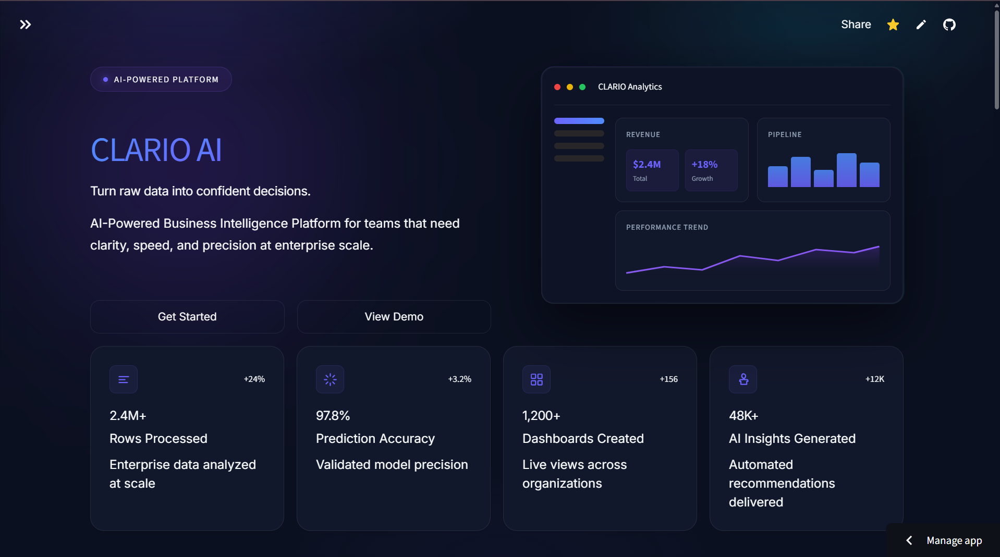
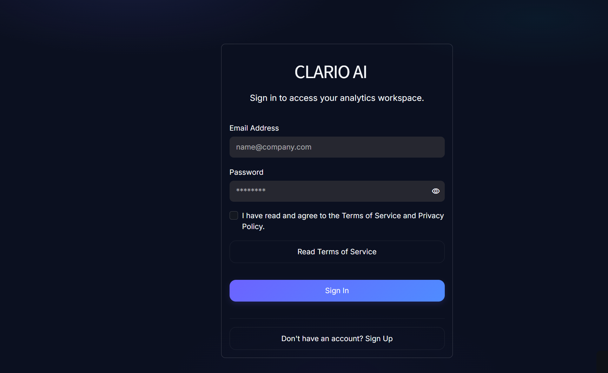
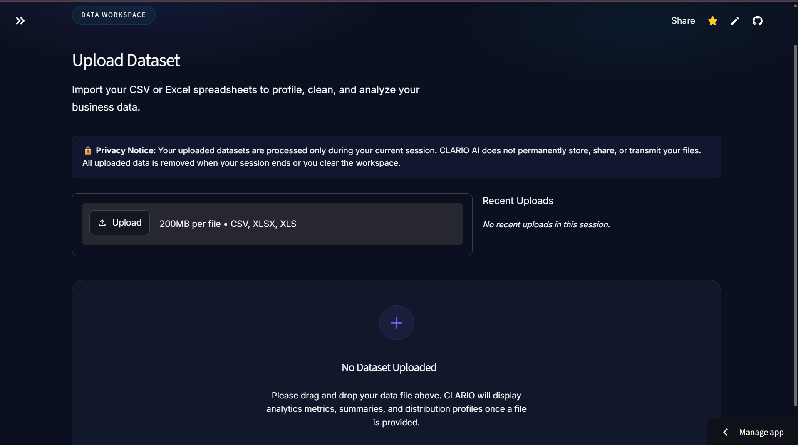
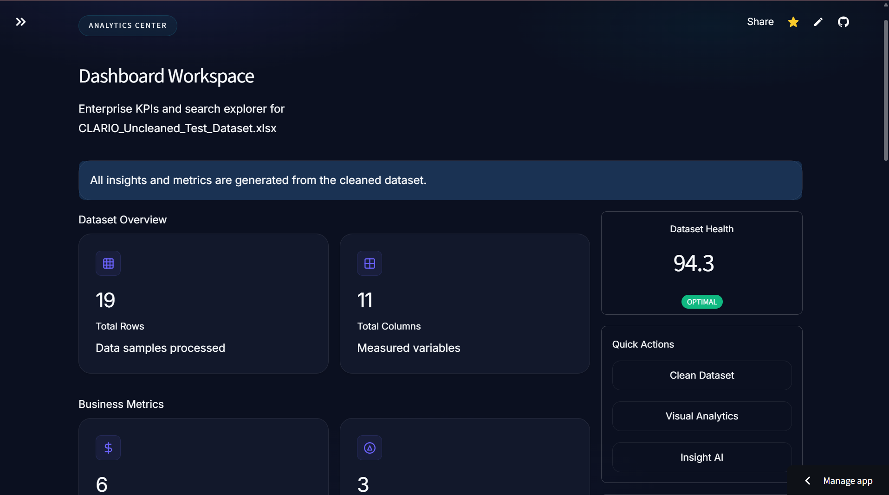
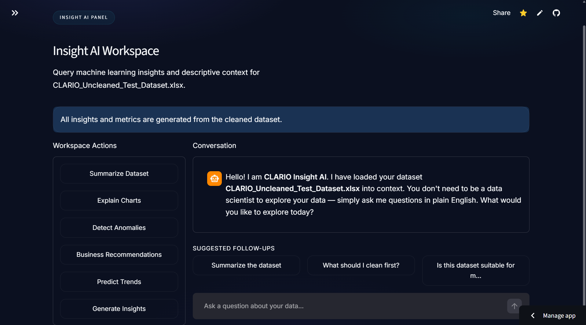

# 🚀 Kosvio

> **Human-Centered Business Intelligence & AI Analytics Platform**

Kosvio is an end-to-end Business Intelligence platform that helps users transform raw business data into meaningful insights. Users can upload datasets, documents, and reports, automatically analyze information, generate AI-powered insights, build interactive dashboards, and create executive-ready reports through an intuitive web interface.

🌐 **Live Demo:** https://kosvio-ai-e9e6dncchahjb4ax.centralindia-01.azurewebsites.net/

---

# ✨ Features

* 🔐 Secure User Authentication
* 📂 Upload CSV & Excel datasets
* 📄 Upload Business Documents (PDF, DOCX)
* 🧠 AI-powered Document Analysis & Information Extraction
* 🧹 Automated Data Cleaning & Data Profiling
* 📊 Interactive Business Intelligence Dashboards
* 📈 KPI Tracking & Performance Analytics
* 🤖 AI Business Insight Assistant
* 📉 Predictive Analytics & Forecasting
* 📑 Executive Report Generation
* 📥 Export Cleaned Data & Reports
* 🌙 Modern Responsive User Interface

---

# 🛠 Tech Stack

| Category                 | Technologies                             |
| ------------------------ | ---------------------------------------- |
| Frontend                 | Streamlit                                |
| Backend                  | Python                                   |
| Data Processing          | Pandas, NumPy                            |
| Data Visualization       | Plotly                                   |
| Database                 | SQLite                                   |
| Machine Learning         | Scikit-learn, Statsmodels                |
| AI & Document Processing | Azure AI Services, Document Intelligence |
| File Processing          | OpenPyXL, PDF Processing Libraries       |
| Version Control          | Git & GitHub                             |
| Deployment               | Microsoft Azure Web App                  |

---

# 🌐 Live Application

Access the deployed application here:

**https://kosvio-ai-e9e6dncchahjb4ax.centralindia-01.azurewebsites.net/**

---

# 📸 Screenshots

### Landing Page



### Login



### Dataset Upload



### Dashboard Analytics



### AI Insights



### Document Analysis


### Reports


---

# 📂 Project Structure

```text
Kosvio/
│
├── analytics/
├── assets/
├── components/
├── data/
├── database/
├── exports/
├── forecasting/
├── models/
├── pages/
├── reports/
├── services/
├── styles/
├── tests/
├── utils/
│
├── app.py
├── requirements.txt
└── README.md
```

---

# ⚙ Installation

Clone the repository:

```bash
git clone https://github.com/Ishita1306/Kosvio.git
```

Move into the project directory:

```bash
cd Kosvio
```

Create a virtual environment:

### Windows

```bash
python -m venv .venv
.venv\Scripts\activate
```

### Linux / macOS

```bash
python3 -m venv .venv
source .venv/bin/activate
```

Install dependencies:

```bash
pip install -r requirements.txt
```

Run the application:

```bash
streamlit run app.py
```

---

# 🚀 Usage

1. Create an account or sign in.
2. Upload business datasets (CSV/Excel) or documents (PDF/DOCX).
3. Automatically clean, profile, and analyze uploaded data.
4. Explore interactive dashboards and KPIs.
5. Generate AI-powered business insights.
6. Analyze important information from uploaded documents.
7. Generate executive reports and export results.

---

# 📄 Supported File Types

Kosvio supports:

### Data Files

* CSV
* Excel (.xlsx)

### Documents

* PDF
* DOCX

Users can extract insights from documents, analyze reports, and combine business data with AI-generated recommendations.

---

# 🔮 Future Enhancements

* Multi-user collaboration
* Cloud database integration
* Advanced forecasting models
* Role-based access control
* Custom dashboard builder
* Improved AI report generation
* PDF export enhancements
* Real-time analytics
* API integrations

---

# 👩‍💻 Developer

**Ishita Goswami**

B.Tech Computer Science Engineering (Data Science)

---

# 📄 License

This project is licensed under the MIT License.

